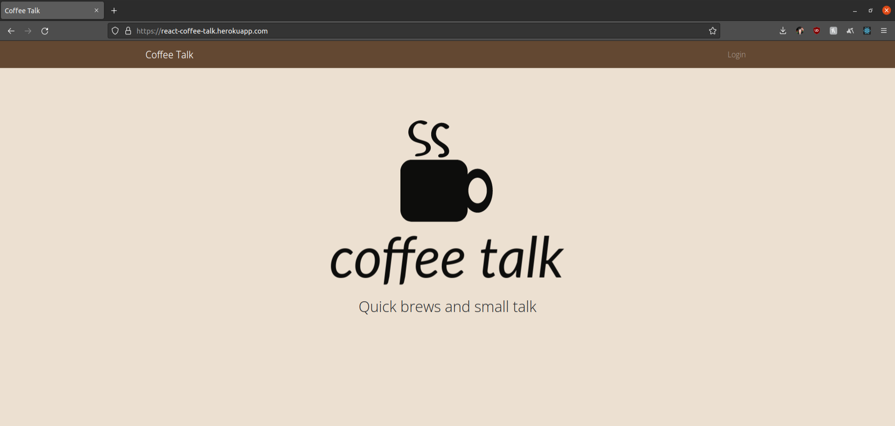
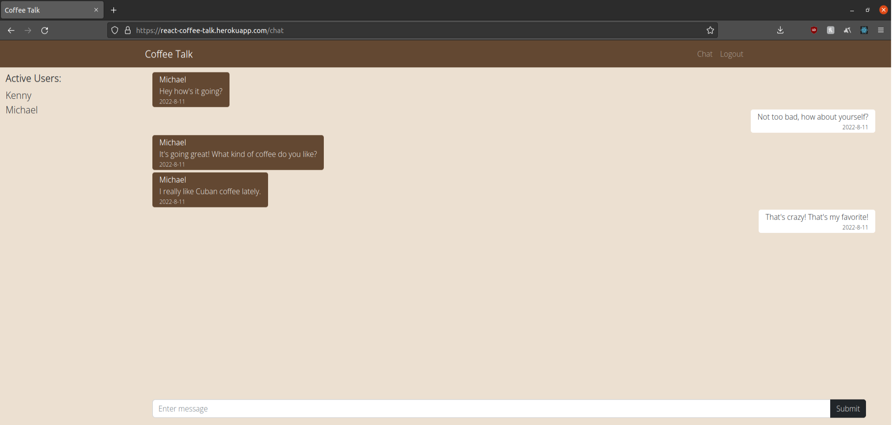

## coffee talk

`coffee talk` is a real-time chat web application utilizing React, Node.js, and Postgresql. This project improves upon the idea of the backend's capability. 

### Summary

Have you unexpectedely ran into an old acquaintance from school or a previous job? The best way to catch up with someone is over a nice cup of coffee at a quaint local spot in your city. To begin, just create an account with a simple username and four digit password.

`coffee talk` utilizes websockets to enable bi-directional communication between the client and server. In unison with a Postgresql database, messages and active users can be updated accordingly to display on each connected client to the websocket. User registration is handled using the database and JWT tokens to securely communicate sensitive information when creating and logging into the account.

### Installation Instructions
1. In the root of the project, run `npm run install` in the terminal.
2. In Postgres, create a new database called `coffee_talk`.
3. Run the `seed.sql` SQL code against the newly created database in step 4.
4. Clone the `.env_template` file in the `server` folder, rename it to `.env` and replace the environment variables with their appropriate values.
5. In the root of the project, run `npm run start` in the terminal.
